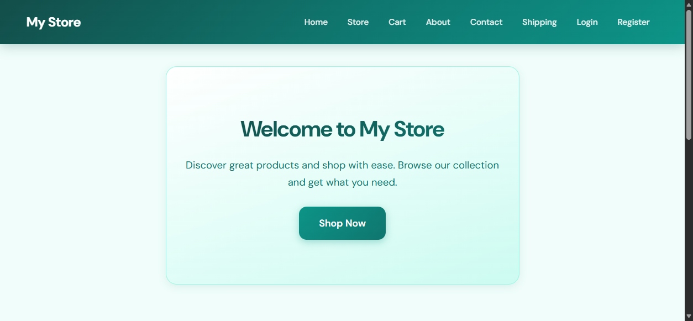

# E-commerce Prototype

This is a Django-based e-commerce web application developed as a learning project. It demonstrates the implementation of core e-commerce functionalities such as custom authentication, product browsing, shopping cart management, and order processing.



## Features

*   **Custom Authentication System**:
    *   User registration with email, password, name, and profile image.
    *   Custom login and logout functionality using session management.
    *   Does not rely on Django's built-in User model for customer authentication.

*   **Product Catalog**:
    *   Browse products by category.
    *   Search products by title and description.
    *   Sort products by price, name, or date (newest/oldest).
    *   Filter products by date added (past week, past month).
    *   Pagination support (implied by typical Django patterns, though simple list implemented currently).

*   **Shopping Cart**:
    *   Add products to the cart.
    *   Manage product quantities.
    *   Stock validation (prevents adding more than available stock).
    *   Persistent cart for logged-in users.

*   **Order Management**:
    *   Place orders from the cart.
    *   View order history.
    *   Order summaries and detailed item views.

*   **Admin Interface**:
    *   Enhanced admin dashboard using `jazzmin` for managing products, categories, users, and orders.

## Tech Stack

*   **Backend**: Django 5.2.4 (Python)
*   **Database**: SQLite (default)
*   **Frontend**: HTML, CSS, Django Templates
*   **Admin Theme**: Jazzmin

## Setup and Installation

1.  **Clone the repository**:
    ```bash
    git clone https://github.com/Lakhan-Bhutiya/E_commerce_proto.git
    cd E_commerce_proto
    ```

2.  **Create a virtual environment** (optional but recommended):
    ```bash
    python -m venv venv
    # Activate on Windows
    venv\Scripts\activate
    # Activate on macOS/Linux
    source venv/bin/activate
    ```

3.  **Install dependencies**:
    ```bash
    pip install django jazzmin
    # Or use requirements.txt if available
    ```

4.  **Run Migrations**:
    ```bash
    python manage.py migrate
    ```

5.  **Create a Superuser** (for Admin access):
    ```bash
    python manage.py createsuperuser
    ```

6.  **Run the Server**:
    ```bash
    python manage.py runserver
    ```

7.  **Access the application**:
    *   Store: `http://127.0.0.1:8000/`
    *   Admin: `http://127.0.0.1:8000/admin/`

## Learning Goals

This project serves as a practical exercise to understand:
*   Django MVT (Model-View-Template) architecture.
*   Handling form submissions and user input.
*   Session-based authentication implementation.
*   Database modeling for e-commerce (Users, Products, Orders).
*   QuerySet filtering and sorting.

## Contributing

As this is a learning project, contributions to improve the code, add features, or fix bugs are welcome!
